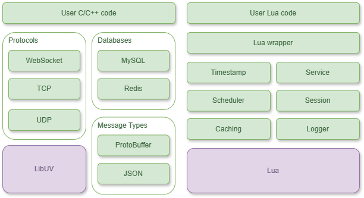
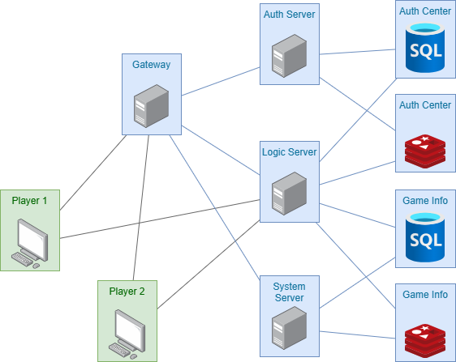

# About

front-end of this project: [Weikang01/advance_game_dev_project: this is a Unity-based 2D platformer (github.com)](https://github.com/Weikang01/advance_game_dev_project)

## Framework 

The core framework of our distributed game server is built using C/C++. The choice is driven by the language's high performance and efficiency, which are paramount in real-time gaming scenarios. C/C++ offers granular control over system resources, allowing for optimizations that are crucial in a multiplayer gaming environment. The execution speed and minimal runtime overhead of C/C++ make it an excellent choice for developing the backbone of our server, handling complex computations and managing high concurrency without sacrificing performance.

Besides using C/C++ for our game server's main framework, we also chose Lua as the scripting language. This choice is based on several reasons that help us build the server better. First, Lua is simple and doesn't slow down the server. Since Lua's code is also in C, it works well with our C/C++ code, making it easy to combine them. Coding in Lua is faster than in C, which helps us make changes and add new things quickly.

Lua's way of writing code is straightforward, which makes our work easier and less prone to mistakes. Also, Lua handles some of the more complex parts of programming, like managing memory, which lets us focus more on creating the server's features. By using both C/C++ and Lua, we get the best of both worlds: the power and speed of C/C++ for the heavy lifting and the ease and speed of Lua for adding features and making changes.

## Game Server architecture

Apart from the framework, we built a game server on top of that. This cluster is made up of four main servers: a gateway, an authentication server, a system server, and a logic server. We also set up four databases to back these servers up—two for holding user information (one uses MySQL and the other Redis) and another two for storing game-related user data (also split between MySQL and Redis). We record the IP addresses and ports for these servers and databases in configuration files, which makes it really handy to move and deploy our game system wherever it's needed. Now, let's dig a bit deeper into why we organized things this way.

# How to run this project locally

This project is depends on

* [libuv v1.9.1](https://github.com/libuv/libuv/tree/v1.9.1)
* [protobuf-3.21.12](https://github.com/protocolbuffers/protobuf/tree/v3.21.12)

## setup libuv v1.9.1

* copy `include` and `src` folder to `vendor\libuv`
* in project settings, include both `vendor\libuv\include` and `vendor\libuv\src`
* add `_CRT_NONSTDC_NO_DEPRECATE;_CRT_SECURE_NO_WARNINGS;_CRT_SECURE_NO_DEPRECATE;` in C/C++:arrow_right: Preprocessor :arrow_right: Preprocessor Definitions if raise deprecation related errors
* change C/C++ :arrow_right: General :arrow_right: SDL checks to `No(sdl-)` if some bugs persist
* add dependent libraries `ws2_32.lib IPHLPAPI.lib Userenv.lib Psapi.lib`

## setup protobuf-3.21.12

* after `git clone` use `git submodule update --init --recursive` to download gmock and gtest
* create a folder, then use CMake to build the project and save the project solution in the newly created folder
* double click the solution, build `libprotobuf` `libprotoc` and `protoc`
* copy the yielded libraries `libprotobuf.lib` `libprotoc.lib` to your project
* add library folder path to your project's link
* add dependent libraries ``libprotobuf.lib` `libprotoc.lib``